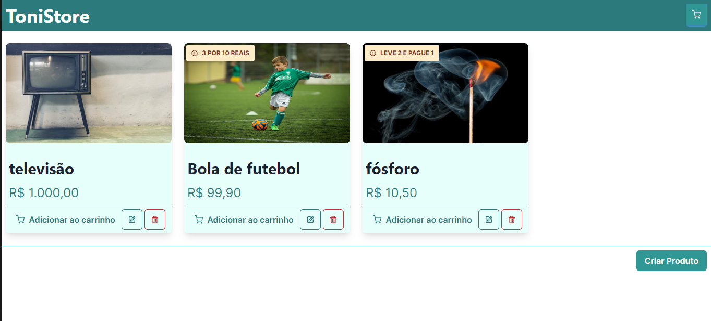
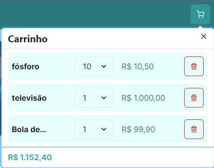

# 
Aplicação full-stack de um e-commerce chamado de ToniStore, utilizando NextJS e NestJS.

---

### _Critérios de aceitação_

- [x] Deve existir um CRUD de produtos;
- [x] Cada produto deve ter ao menos as seguintes informações: nome e preço;
- [x] Duas promoções já devem existir no sistema: “Leve 2 e Pague 1” e “3 por R$10,00”;
- [x] No cadastro de um produto, deve ser possível associá-lo a uma promoção existente ou a nenhuma delas;
- [x] As informações do produto precisam ser persistidas;
- [x] Deve ser possível adicionar, remover e editar itens do carrinho de compras;
- [x] O valor total do carrinho de compras deve ser calculado com base nos Produtos selecionados considerando suas respectivas promoções;
- [x] Devem estar descritas as promoções aplicadas para cada item, caso existam;

## 

## Artefato do domínio Cart (Carrinho)

| Item            | Amount | Price       | Promotion        |
| --------------- | ------ | ----------- | ---------------- |
| Fósforo         | 10     | R$ 10,50    | LEVE 2 E PAGUE 1 |
| Bola de futebol | 1      | R$ 1.000,00 |                  |
| televisão       | 1      | R$ 99,90    | 3 POR 10 REAIS   |

**TotalPrice: R$ 1.152,40**

## 

## Escolha das tecnologias

Escolhi as tecnologias com base em NodeJS (além de eu ter mais familiaridade) por ter uma sintaxe mais unificada e desenvolvimento de software mais 'expresso'. Para melhor agilidade e pelo tamanho do projeto, tecnologias NodeJS se encaixam muito bem.

## Passo-a-passo para iniciar o projeto

### Api

Para rodar a API, primeiro você precisa inicializar o docker:

```
  docker compose up -d
```

Após subir o docker, instale as dependências e rode o projeto:

```
  npm i
  npm run start:dev
```

### Frontend

_(Você precisa ter a API rodando para iniciar o frontend!!!)_

Rode o projeto NextJS

```
  npm i
  npm run dev
```

Teste a aplicação :)

### Pontos de melhoria:

Por conta do limite de tempo, infelizmente tive que retirar algumas partes de acordo com o meu potencial de produção.  
Essas partes são:

- Testes unitários;
- Autenticação e domínio User;
- Documentação com Swagger;
